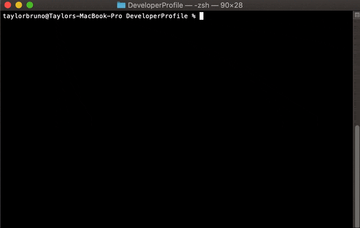
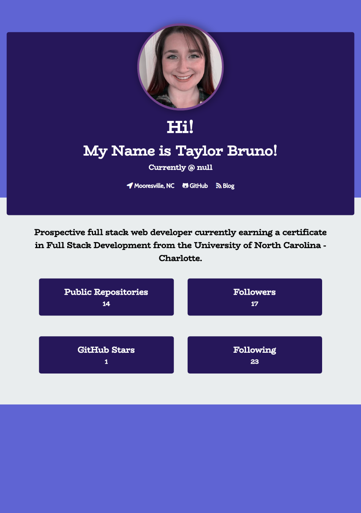

# Developer Profile

This is a command-line application dynamically generates a PDF profile from a GitHub username.

## Getting Started
Command-line Interface:<br>


###### HTML has been removed to have pure PDF functionality.

Example Output: <br>


### Installing
Before you continue, you will need to ensure `npm install` has been completed for the following:

* [Puppeteer](https://www.npmjs.com/package/puppeteer)
* [Axios](https://www.npmjs.com/package/axios)
* [Inquirer](https://www.npmjs.com/package/inquirer)

### How to use
To run the application:
```sh 
node index.js
```
The user will then be asked for their GitHub usernames and to choose a color from a list.<br>

The application will then create a pdf of the data collected through Axios calls.<br>

The user will be able to view:
1. Total Public Repositories
2. Star count
3. Followers count
4. Following count


### Built With
* Node.js
* JavaScript/ES6
* HTML and CSS created dynamically
* Font Awesome - for icons
* GoogleFonts

#### License <br>MIT License Copyright (c) 2019 Taylor M Bruno<br>Permission is hereby granted, free of charge, to any person obtaining a copy of this software and associated documentation files (the "Software"), to dealin the Software without restriction, including without limitation the rights to use, copy, modify, merge, publish, distribute, sublicense, and/or sell copies of the Software, and to permit persons to whom the Software is furnished to do so, subject to the following conditions:<br><br>The above copyright notice and this permission notice shall be included in all copies or substantial portions of the Software.<br><br>THE SOFTWARE IS PROVIDED "AS IS", WITHOUT WARRANTY OF ANY KIND, EXPRESS OR IMPLIED, INCLUDING BUT NOT LIMITED TO THE WARRANTIES OF MERCHANTABILITY, FITNESS FOR A PARTICULAR PURPOSE AND NONINFRINGEMENT. IN NO EVENT SHALL THE AUTHORS OR COPYRIGHT HOLDERS BE LIABLE FOR ANY CLAIM, DAMAGES OR OTHER LIABILITY, WHETHER IN AN ACTION OF CONTRACT, TORT OR OTHERWISE, ARISING FROM, OUT OF OR IN CONNECTION WITH THE SOFTWARE OR THE USE OR OTHER DEALINGS IN THE SOFTWARE.